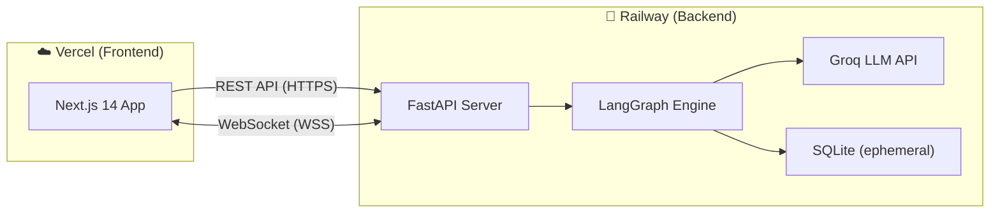

# NEXUS — AI Task Execution Agent — Implementation Plan

## Goal

Build and deploy a full-stack AI Task Execution Agent that accepts complex natural-language instructions, decomposes them into steps, executes them with specialist workers, self-heals on failure, supports human-in-the-loop breakpoints, and streams the entire process in real-time via a cinematic dashboard.

- **LLM Provider**: Groq (fast inference, free tier)
- **Frontend**: Next.js 14 → Deployed on **Vercel**
- **Backend**: FastAPI (Python) → Deployed on **Railway**
- **Real-time**: WebSockets (Railway supports persistent WebSocket connections)

---

## User Review Required

> [!IMPORTANT]
> **Groq API Key**: You'll need a free Groq API key from [console.groq.com](https://console.groq.com). Do you already have one?

> [!IMPORTANT]
> **Railway Account**: Free tier gives 500 hours/month. The backend needs persistent process support for WebSockets. Do you have a Railway account?

> [!WARNING]
> **Persistent Storage**: Railway uses ephemeral filesystem — SQLite data is lost on redeploy. For the demo this is acceptable (execution history resets on deploy). If you want persistence, we can add a Railway PostgreSQL addon. **Your preference?**

> [!IMPORTANT]
> **Redis**: We have two options:
> 1. **Skip Redis** — Use an in-memory event bus (simpler, works fine for single-instance Railway deployment)
> 2. **Upstash Redis** — Free tier, serverless Redis (needed only if you want multi-instance scaling)
> 
> I recommend **Option 1 (skip Redis)** for simplicity since Railway runs a single instance anyway.

---

## Architecture (Vercel + Railway)



### Key Deployment Details

| Concern | Solution |
|---|---|
| **CORS** | FastAPI middleware allows `https://<your-app>.vercel.app` origin |
| **WebSocket URL** | Frontend reads `NEXT_PUBLIC_WS_URL` env var (set in Vercel dashboard pointing to Railway) |
| **API URL** | Frontend reads `NEXT_PUBLIC_API_URL` env var |
| **Groq Key** | Stored as Railway environment variable `GROQ_API_KEY` |
| **Health Check** | Railway pings `GET /health` to keep the service alive |
| **File Uploads** | Multipart form upload via REST → stored in Railway `/tmp` during execution |

---

## Proposed Changes

### Component 1: Backend (FastAPI + LangGraph)

All backend code lives in `backend/`. Deployed to Railway via GitHub push.

---

#### [NEW] `backend/requirements.txt`
Core dependencies:
```
fastapi==0.115.0
uvicorn[standard]==0.30.0
websockets==12.0
python-multipart==0.0.9
langgraph==0.2.0
langchain-groq==0.2.0
langchain-core==0.3.0
pandas==2.2.0
matplotlib==3.9.0
plotly==5.24.0
weasyprint==62.0
pydantic==2.9.0
python-dotenv==1.0.1
aiosqlite==0.20.0
httpx==0.27.0
duckduckgo-search==6.3.0
```

---

#### [NEW] `backend/main.py`
FastAPI application entry point:
- CORS middleware configured for Vercel origin + localhost
- REST routes mounted from `api/routes.py`
- WebSocket endpoint mounted from `api/websocket.py`
- Startup event: initialize SQLite database
- Health check endpoint at `GET /health`

---

#### [NEW] `backend/config.py`
Environment configuration:
- `GROQ_API_KEY` — from env
- `GROQ_MODEL` — default `llama-3.3-70b-versatile`
- `ALLOWED_ORIGINS` — Vercel URL + localhost for dev
- `MAX_RETRIES` — default 2
- `HITL_CONFIDENCE_THRESHOLD` — default 0.6

---

#### [NEW] `backend/agents/orchestrator.py`
The Planner agent:
- Takes user instruction + optional file metadata + memory context
- Calls Groq LLM with a structured prompt
- Returns a JSON execution plan with steps, workers, dependencies, risk levels
- Also handles **re-planning** when called with error context from the Critic

---

#### [NEW] `backend/agents/critic.py`
The Evaluator agent:
- Receives step instruction, expected output, and actual output
- Calls Groq LLM to assess quality and correctness
- Returns verdict (PASS/FAIL), confidence score, reasoning, and HITL flag
- Triggers recovery routing on FAIL or HITL on low confidence / high risk

---

#### [NEW] `backend/agents/memory.py`
Context accumulation:
- Stores outputs from each completed step
- Stores error contexts from failed attempts
- Provides accumulated context to Orchestrator for re-planning
- Resets per execution run

---

#### [NEW] `backend/workers/base_worker.py`
Abstract base class:
- `execute(instruction, context, uploaded_files) → WorkerResult`
- Standardized result format: `{success, output, artifacts, error}`
- Timeout enforcement via `asyncio.wait_for`

---

#### [NEW] `backend/workers/data_processor.py`
Pandas-based data operations:
- CSV loading, schema profiling, null analysis
- Cleaning: null handling, deduplication, date normalization
- Aggregation: groupby, statistical summaries
- Executes generated pandas code in a subprocess with timeout

---

#### [NEW] `backend/workers/chart_generator.py`
Visualization worker:
- Generates matplotlib/plotly charts from DataFrames
- Returns PNG image bytes (base64 encoded for frontend)
- Supports bar, line, pie, scatter chart types

---

#### [NEW] `backend/workers/report_builder.py`
PDF report generation:
- Takes Markdown content + embedded chart images
- Renders to PDF via WeasyPrint
- Returns PDF file bytes (base64 encoded)

---

#### [NEW] `backend/workers/api_handler.py`
HTTP request worker:
- Makes GET/POST requests to external APIs
- Parses JSON/XML responses
- Implements retry with exponential backoff
- Rate limiting awareness

---

#### [NEW] `backend/workers/text_transformer.py`
LLM-powered text operations:
- Summarization, entity extraction, formatting
- Uses Groq for inference
- Constrained output parsing

---

#### [NEW] `backend/workers/web_researcher.py`
Search and scrape worker:
- DuckDuckGo search integration
- Web page content extraction
- Result summarization

---

#### [NEW] `backend/engine/state.py`
LangGraph state definition:
```python
class AgentState(TypedDict):
    task: str
    plan: dict
    current_step: int
    step_results: list
    memory: dict
    status: str  # planning, executing, evaluating, recovery, hitl_paused, completed, aborted
    error_context: Optional[str]
    hitl_request: Optional[dict]
    hitl_response: Optional[dict]
    retry_count: int
    uploaded_files: list
    events: list  # accumulated events for WebSocket streaming
```

---

#### [NEW] `backend/engine/state_machine.py`
LangGraph graph construction:
- Nodes: `plan`, `execute_step`, `evaluate`, `recover`, `handle_hitl`, `complete`
- Edges: conditional routing based on Critic verdict and state flags
- Entry: `plan` node
- The HITL node **blocks** execution and waits for a WebSocket message from the frontend

---

#### [NEW] `backend/engine/router.py`
Conditional edge logic:
- After `evaluate`: route to `execute_step` (next), `recover` (fail), `handle_hitl` (ambiguous), or `complete` (done)
- After `recover`: route to `execute_step` (retry) or `complete` (max retries → abort)
- After `handle_hitl`: route to `execute_step` (approved) or `complete` (aborted)

---

#### [NEW] `backend/engine/hitl.py`
Human-in-the-loop manager:
- Detects HITL conditions (risk level, confidence, data anomalies)
- Creates HITL request payloads with options for the user
- Manages asyncio Event for blocking/resuming execution

---

#### [NEW] `backend/api/routes.py`
REST endpoints:
- `POST /execute` — Start new execution (accepts task text + file upload), returns execution_id
- `GET /executions` — List past executions
- `GET /executions/{id}` — Get execution details + events for replay
- `GET /executions/{id}/artifacts/{name}` — Download generated artifacts
- `GET /health` — Health check

---

#### [NEW] `backend/api/websocket.py`
WebSocket handler:
- `WS /ws/{execution_id}` — Client connects to stream events for an execution
- Sends events: `plan_created`, `step_start`, `step_complete`, `step_fail`, `hitl_request`, `recovery_start`, `execution_complete`, `execution_aborted`
- Receives: `hitl_response` from client (user's decision)

---

#### [NEW] `backend/api/schemas.py`
Pydantic models:
- `ExecutionRequest`, `ExecutionResponse`
- `StepPlan`, `StepResult`, `CriticVerdict`
- `HITLRequest`, `HITLResponse`
- `ExecutionEvent`, `ExecutionSummary`

---

#### [NEW] `backend/db/database.py`
SQLite setup:
- Async SQLite via `aiosqlite`
- Create tables on startup
- CRUD operations for executions and events

---

#### [NEW] `backend/db/models.py`
Database models:
- `executions` table (id, task, status, created_at, duration, total_steps)
- `execution_events` table (id, execution_id, timestamp, event_type, agent, step_id, payload)

---

#### [NEW] `backend/data/sample_sales.csv`
Pre-generated demo dataset:
- ~500 rows of messy sales data
- Intentional issues: nulls, duplicate rows, mixed date formats, outliers
- Columns: transaction_id, date, product, category, quantity, unit_price, revenue, region

---

#### [NEW] `backend/Procfile`
Railway process command:
```
web: uvicorn main:app --host 0.0.0.0 --port $PORT
```

---

#### [NEW] `backend/railway.json`
Railway configuration:
```json
{
  "$schema": "https://railway.app/railway.schema.json",
  "build": { "builder": "NIXPACKS" },
  "deploy": {
    "startCommand": "uvicorn main:app --host 0.0.0.0 --port ${PORT}",
    "healthcheckPath": "/health",
    "restartPolicyType": "ON_FAILURE"
  }
}
```

---

### Component 2: Frontend (Next.js)

All frontend code lives in `frontend/`. Deployed to Vercel via GitHub push.

---

#### [NEW] `frontend/package.json`
Dependencies:
- `next`, `react`, `react-dom`
- `@xyflow/react` (React Flow v12 for DAG)
- `zustand` (lightweight state management)
- `lucide-react` (icons)
- `framer-motion` (animations)
- `@fontsource/inter` + `@fontsource/jetbrains-mono`

---

#### [NEW] `frontend/app/layout.tsx`
Root layout:
- Dark theme (`#0a0e27` background)
- Inter font for UI, JetBrains Mono for logs
- Meta tags for SEO
- Global CSS import

---

#### [NEW] `frontend/app/page.tsx`
Main execution dashboard — three-panel layout:
1. **Left Panel**: Task input + file upload + execute button + HITL zone
2. **Right Top Panel**: Live DAG visualizer
3. **Bottom Panel**: Execution log stream + download cards

---

#### [NEW] `frontend/app/history/page.tsx`
Execution history page:
- Table of past executions (fetched via REST from Railway)
- Click to view replay of any execution
- Replay mode: DAG + logs animate through saved events

---

#### [NEW] `frontend/components/TaskInput.tsx`
- Textarea with placeholder examples
- File upload dropzone (CSV, JSON, TXT)
- "Execute" button with loading state
- Calls `POST /execute` on Railway backend

---

#### [NEW] `frontend/components/ExecutionLog.tsx`
- Real-time log stream from WebSocket
- Each line typed out with typewriter animation
- Color-coded by event type (🧠 blue, ⚡ yellow, ✅ green, ❌ red, ⚠️ amber)
- Auto-scrolls to bottom
- Download cards appear inline for generated artifacts

---

#### [NEW] `frontend/components/DagVisualizer.tsx`
- React Flow graph rendering the execution plan as nodes + edges
- Custom node component with status-based styling:
  - Pending: dim gray
  - Running: pulsing electric blue ring
  - Passed: glowing green
  - Failed: red with error icon
  - Recovery: amber spinning
- Edges animate with a flowing particle when active
- Auto-layout using dagre algorithm

---

#### [NEW] `frontend/components/HitlModal.tsx`
- Slides up from bottom when HITL event received
- Yellow/amber warning stripe header
- Shows the agent's question + context
- Option buttons (dynamically generated from HITL request)
- Sends decision back via WebSocket
- Execution timer pauses visibly

---

#### [NEW] `frontend/components/ProgressBar.tsx`
- Top-of-page progress indicator
- Shows "Step X/Y" with step name
- Animated fill bar
- Estimated time countdown

---

#### [NEW] `frontend/components/DownloadCard.tsx`
- Card component for downloadable artifacts
- Shows file name, type icon, size
- Click to download (fetches from Railway backend)

---

#### [NEW] `frontend/hooks/useWebSocket.ts`
- Manages WebSocket connection to `wss://<railway-url>/ws/{execution_id}`
- Auto-reconnect with exponential backoff
- Dispatches events to Zustand store
- Sends HITL responses

---

#### [NEW] `frontend/hooks/useExecutionState.ts`
- Zustand store for execution state
- Tracks: plan, current step, step results, log entries, DAG node states, HITL requests
- Actions: addLogEntry, updateNodeState, setHitlRequest, clearExecution

---

#### [NEW] `frontend/styles/globals.css`
Design system:
- CSS custom properties for colors, spacing, typography
- Dark theme: deep navy base, electric blue/green/amber accents
- Glassmorphism card styles with backdrop blur
- Typewriter animation keyframes
- Pulse/glow animations for DAG nodes
- Responsive breakpoints

---

#### [NEW] `frontend/.env.example`
```
NEXT_PUBLIC_API_URL=https://<your-railway-app>.up.railway.app
NEXT_PUBLIC_WS_URL=wss://<your-railway-app>.up.railway.app
```

---

### Component 3: Project Root

---

#### [NEW] `README.md`
Comprehensive README:
- Project overview and architecture diagram
- Live demo link (Vercel URL)
- Local development setup (both frontend and backend)
- Environment variables documentation
- Deployment guide (Vercel + Railway)
- Demo scenario walkthrough
- Design decision justifications
- Tech stack table

---

#### [NEW] `.gitignore`
Standard ignores for Python + Node.js + env files

---

#### [NEW] `docker-compose.yml` (for local development)
- Backend service (Python + FastAPI)
- Frontend service (Next.js dev server)
- Shared network
- Volume mounts for hot reload

---

## Open Questions

> [!IMPORTANT]
> 1. **Do you have a Groq API key?** If not, get one free at [console.groq.com](https://console.groq.com)
> 2. **Railway persistent storage**: Accept ephemeral SQLite (execution history resets on redeploy), or add PostgreSQL addon?
> 3. **Redis**: Skip it and use in-memory event bus (recommended for simplicity)?
> 4. **WeasyPrint on Railway**: This needs system-level dependencies (libpango, libcairo). Railway's Nixpacks should handle it, but if it causes issues we can switch to `fpdf2` or `reportlab` as a simpler PDF library. OK with fallback?
> 5. **Sample demo scenario**: The "messy CSV → financial report" pipeline — good to proceed with this, or do you have a different scenario in mind?

---

## Verification Plan

### Automated Tests
1. **Backend unit tests**: Test each worker independently with mock data
2. **State machine tests**: Verify all state transitions (happy path + failure + HITL)
3. **Integration test**: Full execution of demo scenario end-to-end locally
4. **WebSocket test**: Verify event streaming and HITL round-trip

### Manual Verification
1. Run locally: `backend → uvicorn`, `frontend → npm run dev` — full demo scenario
2. Deploy backend to Railway — verify health check and WebSocket connectivity
3. Deploy frontend to Vercel — verify it connects to Railway backend
4. Run the demo scenario on the live deployed version
5. Test graceful failure: provide a task that will cause a step to fail
6. Test HITL: provide ambiguous data that triggers a user decision
7. Test execution history: run multiple tasks, verify history page shows replays

### Browser Tests
- Navigate to Vercel URL → enter task → observe DAG animation + log streaming
- Trigger HITL → respond → verify execution resumes
- Check History page → click past execution → verify replay works
- Download generated artifacts (PDF, chart images)
